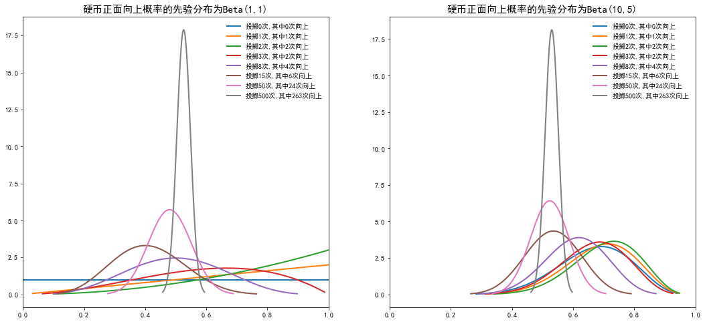

# 第三次作业
## 1. 投硬币
### 1.1 问题重述
&emsp;&emsp;考虑掷硬币试验。分别使用参数为(a,b)=(1,1)和(a,b)=(10,5)的贝塔分布作为先验，用程序分别画出出现下列正面向上的计数结果时，硬币向上的概率参数的后验分布：
1. 投掷0次，0次正面向上
2. 投掷1次，1次正面向上
3. 投掷2次，2次正面向上
4. 投掷3次，2次正面向上
5. 投掷8次，4次正面向上
6. 投掷15次，6次正面向上
7. 投掷50次，24次正面向上
8. 投掷500次，263次正面向上

## 1.2 解答
抛硬币场景，$\theta$为硬币正面向上的概率，x是n次实验观测到正面向上的次数
$$
P(\theta \mid  x) = \frac{P(x \mid   \theta) P(\theta)}{P(x)} = \frac{P(x \mid   \theta) P(\theta)}{\int P(x \mid   \theta) P(\theta) d\theta}
$$
由于原问题为多次抛硬币，分布为二项分布
$$
P(x \mid   \theta) = C_{n}^x \theta^x (1-\theta)^{n-x}
$$

由于题目假设参数$\theta$的先验分布为Beta分布:
$$
P(\theta) = \frac{1}{B(a,b)}\theta^{a-1}(1-\theta)^{b-1}
$$
所以:
$$
\begin{aligned}
P(x) &= \int P(x \mid \theta) P(\theta) d\theta\\
&= \int_{0}^{1} C_{n}^x \theta^x (1-\theta)^{n-x} \frac{1}{B(a,b)}\theta^{a-1}(1-\theta)^{b-1} d\theta\\
&= \frac{C_{n}^x}{B(a,b)} \int_{0}^{1} \theta^{a+x-1} (1-\theta)^{b+n-x-1} d\theta\\
&= C_{n}^x \frac{B(a+x,b+n-x)}{B(a,b)} \int_{0}^{1} \frac{1}{B(a+x,b+n-x)}\theta^{a+x-1} (1-\theta)^{b+n-x-1} d\theta\\
&= C_{n}^x \frac{B(a+x,b+n-x)}{B(a,b)} \int_{0}^{1} Beta(a+x,b+n-x)d\theta\\
&= C_{n}^x \frac{B(a+x,b+n-x)}{B(a,b)}
\end{aligned}
$$
所以后验分布:
$$
\begin{aligned}
P(\theta \mid  x) &= \frac{C_{n}^x \theta^x (1-\theta)^{n-x} \frac{1}{B(a,b)}\theta^{a-1}(1-\theta)^{b-1}}{C_{n}^x \frac{B(a+x,b+n-x)}{B(a,b)}}\\
&=\frac{1}{B(a+x,b+n-x)} \theta^{a+x-1}(1-\theta)^{n+b-x-1} \\
&= Beta(\theta \mid a+x,b+n-x)
\end{aligned}
$$


```python
import numpy as np
# https://docs.scipy.org/doc/scipy/reference/generated/scipy.stats.beta.html
from scipy.stats import beta
import matplotlib.pyplot as plt
plt.rcParams['font.sans-serif'] = ["SimHei"]  # 用来正常显示中文标签
plt.rcParams['axes.unicode_minus'] = False  # 用来正常显示负号


def draw_beta_plot(ax, a, b, n, x, style='r-'):  # 其中a,b为先验分布的参数，n为总投掷次数，x为正面向上次数
    result_a = a+x
    result_b = b+n-x
    x_line = np.linspace(beta.ppf(0.001, result_a, result_b),
                         beta.ppf(0.999, result_a, result_b), 1000)
    ax.plot(x_line, beta.pdf(x_line, result_a, result_b),
            lw=2, label="投掷{n}次,其中{x}次向上".format(n=n, x=x))
    ax.legend(loc='best', frameon=False)
    plt.xlim(0,1)


# 先验为(a,b)=(1,1)和(a,b)=(10,5)
# 定义一组alpha 跟 beta值
n_list = [0,1,2,3,8,15,50,500]
x_list = [0,1,2,2,4,6,24,263]
plt.figure(figsize=(18, 8))
ax = plt.subplot(1,2,1)
ax.set_title("硬币正面向上概率的先验分布为Beta(1,1)", fontsize=15)
for n,x in zip(n_list,x_list):
    draw_beta_plot(ax,a=1,b=1,n=n,x=x)
ax = plt.subplot(1,2,2)
ax.set_title("硬币正面向上概率的先验分布为Beta(10,5)", fontsize=15)
for n,x in zip(n_list,x_list):
    draw_beta_plot(ax,a=10,b=5,n=n,x=x)
plt.savefig("抛硬币.png",dpi=300)
```


    

    


## 2.分布证明

### 2.1 多项分布的共轭先验是狄利克雷分布
似然函数是多项分布,其中$\theta_i$表示第i类出现的概率，$n_i$表示第i类出现的数量。通过伽马函数$\Gamma(x)=\int_{0}^{\infty} t^{x-1} e^{-t} dt$对阶乘进行近似,有$\Gamma(x+1) = x！$:
$$
P(x \mid \theta) = \frac{n!}{n_1!n_2!...n_k!}\prod_{i=1}^k \theta_i^{n_i} = \frac{\Gamma(n+1)}{\prod_{i=1}^k \Gamma(n_i+1)}\prod_{i=1}^k \theta_i^{n_i}
$$
其中，$\sum_{i=1}^k \theta_i = 1$.

假设概率$\theta = (\theta_1,\theta_2,...,\theta_k)$的先验分布为参数是$\alpha=(\alpha_1,\alpha_2,...,\alpha_k)$的狄利克雷分布$Dir(\alpha)$:
$$
P(\theta)=\frac{\Gamma(\sum_{i=1}^k \alpha_i)}{\prod_{i=1}^{k} \Gamma(\alpha_{i})} \prod_{i=1}^{k} \theta_{i}^{\alpha_{i}-1}
$$

则可以算出归一化因子:

$$
\begin{aligned}
P(x) &= \int P(x \mid \theta) P(\theta) d\theta\\
&= \int_{0}^{1} \frac{\Gamma(n+1)}{\prod_{i=1}^k \Gamma(n_i+1)}\prod_{i=1}^k \theta_i^{n_i} \frac{\Gamma(\sum_{i=1}^k \alpha_i)}{\prod_{i=1}^{k} \Gamma(\alpha_{i})} \prod_{i=1}^{k} \theta_{i}^{\alpha_{i}-1} d\theta\\
&= \int_{0}^{1} \frac{\Gamma(n+1)\Gamma(\sum_{i=1}^k \alpha_i)}{\prod_{i=1}^k \Gamma(n_i+1)\Gamma(\alpha_i)}\prod_{i=1}^{k} \theta_{i}^{n_i+\alpha_{i}-1} d\theta\\
&=\frac{\Gamma(n+1)\Gamma(\sum_{i=1}^k \alpha_i)}{\prod_{i=1}^k \Gamma(n_i+1)\Gamma(\alpha_i)}\frac{\prod_{i=1}^{k} \Gamma(n_i+\alpha_{i})}{\Gamma(\sum_{i=1}^k n_i+\alpha_{i})} \int_{0}^{1} \frac{\Gamma(\sum_{i=1}^k n_i+\alpha_{i})}{\prod_{i=1}^{k} \Gamma(n_i+\alpha_{i})} \prod_{i=1}^{k} \theta_{i}^{n_i+\alpha_{i}-1} d\theta\\
&=\frac{\Gamma(n+1)\Gamma(\sum_{i=1}^k \alpha_i)}{\prod_{i=1}^k \Gamma(n_i+1)\Gamma(\alpha_i)}\frac{\prod_{i=1}^{k} \Gamma(n_i+\alpha_{i})}{\Gamma(\sum_{i=1}^k n_i+\alpha_{i})} \int_{0}^{1} Dir(n+\alpha) d\theta\\
&= \frac{\Gamma(n+1)\Gamma(\sum_{i=1}^k \alpha_i)}{\Gamma(\sum_{i=1}^k n_i+\alpha_{i})}\prod_{i=1}^{k} \frac{\Gamma(n_i+\alpha_{i})}{\Gamma(n_i+1)\Gamma(\alpha_i)}
\end{aligned}
$$

所以$\theta$的后验分布:
$$
\begin{aligned}
P(\theta \mid x) &= \frac{P(x \mid \theta)P(\theta)}{P(x)}\\
&=\frac{\frac{\Gamma(n+1)}{\prod_{i=1}^k \Gamma(n_i+1)}\prod_{i=1}^k \theta_i^{n_i}\frac{\Gamma(\sum_{i=1}^k \alpha_i)}{\prod_{i=1}^{k} \Gamma(\alpha_{i})} \prod_{i=1}^{k} \theta_{i}^{\alpha_{i}-1}}{\frac{\Gamma(n+1)\Gamma(\sum_{i=1}^k \alpha_i)}{\Gamma(\sum_{i=1}^k n_i+\alpha_{i})}\prod_{i=1}^{k} \frac{\Gamma(n_i+\alpha_{i})}{\Gamma(n_i+1)\Gamma(\alpha_i)}}\\
&=\frac{\Gamma(\sum_{i=1}^k n_i+\alpha_i)}{\prod_{i=1}^{k}\Gamma(n_i+\alpha_{i})}\prod_{i=1}^{k} \theta_i^{n_i+\alpha_{i}-1}\\
&=Dir(n+\alpha)
\end{aligned}
$$
$\theta$的先验和后验分布都是狄利克雷分布，似然函数是多项分布，所以多项分布的共轭先验是狄利克雷分布

### 2.2 泊松分布的共轭先验是伽马分布

似然函数是泊松分布,n 表示事件发生的次数，$\lambda$表示单位时间内随机事件的平均发生次数，通过伽马函数$\Gamma(x)=\int_{0}^{\infty} t^{x-1} e^{-t} dt$对阶乘进行近似,有$\Gamma(x+1) = x！$:

$$
P(x = n \mid \lambda) = \frac{\lambda^n}{n!}e^{-\lambda} = \frac{\lambda^n}{\Gamma(n+1)}e^{-\lambda}
$$

假设$\lambda$服从参数为(a,b)的伽马分布Ga(a,b):

$$
P(\lambda) = \frac{\lambda^{a-1}e^{-b \lambda}b^a}{\Gamma(a)}
$$

则可以算出归一化因子:

$$
\begin{aligned}

P(x) &= \int P(x \mid \lambda) P(\lambda) d\lambda\\
&=\int_0^1 \frac{\lambda^n}{\Gamma(n+1)}e^{-\lambda}\frac{\lambda^{a-1}e^{-b \lambda} b^a}{\Gamma(a)} d\lambda\\
&=\frac{b^a}{\Gamma(n+1)\Gamma(a)} \frac{\Gamma(n+a)}{(b+1)^{n+a}}\int_0^1 \lambda^{n+a-1} e^{-(b+1)\lambda} \frac{(b+1)^{n+a}}{\Gamma(n+a)} d\lambda\\
&= \frac{b^a}{\Gamma(n+1)\Gamma(a)} \frac{\Gamma(n+a)}{(b+1)^{n+a}} \int_0^1 Ga(n+a,b+1) d\lambda\\
&= \frac{b^a}{\Gamma(n+1)\Gamma(a)} \frac{\Gamma(n+a)}{(b+1)^{n+a}}
\end{aligned}
$$

所以$\lambda$的后验分布:

$$
\begin{aligned}

P(\lambda \mid x) &= \frac{P(x \mid \lambda)P(\lambda)}{P(x)}\\
&=\frac{\frac{\lambda^n}{\Gamma(n+1)}e^{-\lambda}\frac{\lambda^{a-1}e^{-b \lambda} b^a}{\Gamma(a)}}{\frac{b^a}{\Gamma(n+1)\Gamma(a)} \frac{\Gamma(n+a)}{(b+1)^{n+a}}}\\
&=\frac{(b+1)^{n+a}}{\Gamma(n+a)}\lambda^{n+a-1} e^{-(b+1)\lambda}\\
&=Ga(n+a,b+1)
\end{aligned}
$$

$\lambda$的先验和后验分布都是伽马分布，似然函数是泊松分布，所以泊松分布的共轭先验是伽马分布.


### 2.3 指数分布的共轭先验是伽马分布

似然函数是指数分布,n 表示事件发生的次数，$\lambda$表示单位时间内随机事件的平均发生次数:

$$
P(x = n \mid \lambda) = \lambda e^{-\lambda x}
$$

假设$\lambda$服从参数为(a,b)的伽马分布Ga(a,b):

$$
P(\lambda) = \frac{\lambda^{a-1}e^{-b \lambda}b^a}{\Gamma(a)}
$$

则可以算出归一化因子:

$$
\begin{aligned}

P(x) &= \int P(x \mid \lambda) P(\lambda) d\lambda\\
&=\int_0^1 \lambda e^{-\lambda x}\frac{\lambda^{a-1}e^{-b \lambda} b^a}{\Gamma(a)} d\lambda\\
&=\frac{b^a}{\Gamma(a)}\frac{\Gamma(a+1)}{(b+1)^{a+1}} \int_0^1 \lambda^{a} e^{-(b+1)\lambda} \frac{(b+1)^{a+1}}{\Gamma(a+1)} d\lambda\\
&= \frac{b^a}{\Gamma(a)}\frac{\Gamma(a+1)}{(b+1)^{a+1}} \int_0^1 Ga(a+1,b+1) d\lambda\\
&= \frac{b^a}{\Gamma(a)}\frac{\Gamma(a+1)}{(b+1)^{a+1}}
\end{aligned}
$$

所以$\lambda$的后验分布:

$$
\begin{aligned}

P(\lambda \mid x) &= \frac{P(x \mid \lambda)P(\lambda)}{P(x)}\\
&=\frac{\lambda e^{-\lambda x}\frac{\lambda^{a-1}e^{-b \lambda} b^a}{\Gamma(a)}}{\frac{b^a}{\Gamma(a)}\frac{\Gamma(a+1)}{(b+1)^{a+1}}}\\
&=\frac{(b+1)^{a+1}}{\Gamma(a+1)}\lambda^{a} e^{-(b+1)\lambda}\\
&=Ga(a+1,b+1)
\end{aligned}
$$

$\lambda$的先验和后验分布都是伽马分布，似然函数是指数分布，所以指数分布的共轭先验是伽马分布.


### 2.4 方差已知的正态分布的共轭先验是正态分布

似然函数是方差已知的正态分布分布, $\sigma^2$表示分布的方差为已知固定值不是随机变量，$\mu$表示分布的均值，$x$是随机变量:

$$
P(x \mid \mu)=\frac{1}{\sigma \sqrt{2 \pi}} e^{-\frac{1}{2}\left(\frac{x-\mu}{\sigma}\right)^{2}}
$$

假设参数$\mu$服从参数为$(a,b^2)$的正态分布$\mu\sim N(a,b^2)$:

$$
P(\mu)=\frac{1}{b \sqrt{2 \pi}} e^{-\frac{1}{2}\left(\frac{\mu-a}{b}\right)^{2}}
$$

则可以算出归一化因子:

$$
\begin{aligned}


P(x) &= \int P(x \mid \mu) P(\mu) d\mu\\

&=\int_{-\infty}^{\infty} \frac{1}{\sigma \sqrt{2 \pi}} e^{-\frac{1}{2}\left(\frac{x-\mu}{\sigma}\right)^{2}}\frac{1}{b \sqrt{2 \pi}} e^{-\frac{1}{2}\left(\frac{\mu-a}{b}\right)^{2}} d\mu\\

&=\frac{1}{2 \sigma b \pi}\int_{-\infty}^{\infty} e^{-\frac{1}{2}\frac{(x-\mu)^2b^2+(\mu-a)^2\sigma^2}{\sigma^2 b^2}} d\mu\\
&=\frac{1}{2 \sigma b \pi}\int_{-\infty}^{\infty}exp\left(-\frac{1}{2}\left(\frac{\left(\mu-\frac{xb^2+a\sigma^2}{\sigma^2+b^2}\right)^2}{\frac{\sigma^2b^2}{\sigma^2+b^2}}+\frac{(x-a)^2}{\sigma^2+b^2}\right)\right)d\mu\\
&=\frac{e^{-\frac{1}{2}\frac{(x-a)^2}{\sigma^2+b^2}}}{2 \sigma b \pi}\frac{\sigma b}{\sqrt{\sigma^2+b^2}}\sqrt{2 \pi}\int_{-\infty}^{\infty}\frac{1}{\frac{\sigma b}{\sqrt{\sigma^2+b^2}}\sqrt{2 \pi}}exp\left(-\frac{1}{2}\left(\frac{\left(\mu-\frac{xb^2+a\sigma^2}{\sigma^2+b^2}\right)^2}{\frac{\sigma^2b^2}{\sigma^2+b^2}}\right)\right)d\mu\\
&=\frac{1}{\sqrt{\sigma^2+b^2}\sqrt{2 \pi}}e^{-\frac{1}{2}\frac{(x-a)^2}{\sigma^2+b^2}}\int_{-\infty}^{\infty} \mu\sim N\left(\frac{xb^2+a\sigma^2}{\sigma^2+b^2},\frac{\sigma b}{\sqrt{\sigma^2+b^2}}\right)d\mu\\
&=\frac{1}{\sqrt{\sigma^2+b^2}\sqrt{2 \pi}}e^{-\frac{1}{2}\frac{(x-a)^2}{\sigma^2+b^2}}

\end{aligned}
$$

所以$\mu$的后验分布:

$$
\begin{aligned}


P(\mu \mid x) &= \frac{P(x \mid \mu)P(\mu)}{P(x)}\\

&=\frac{\frac{1}{\sigma \sqrt{2 \pi}} e^{-\frac{1}{2}\left(\frac{x-\mu}{\sigma}\right)^{2}}\frac{1}{b \sqrt{2 \pi}} e^{-\frac{1}{2}\left(\frac{\mu-a}{b}\right)^{2}}}{\frac{1}{\sqrt{\sigma^2+b^2}\sqrt{2 \pi}}e^{-\frac{1}{2}\frac{(x-a)^2}{\sigma^2+b^2}}}\\
&=\frac{\sqrt{\sigma^2+b^2}}{\sigma b\sqrt{2 \pi}}e^{-\frac{1}{2}\left(\left(\frac{x-\mu}{\sigma}\right)^{2}+\left(\frac{\mu-a}{b}\right)^{2}-\frac{(x-a)^2}{\sigma^2+b^2}\right)}\\
&=\frac{1}{\frac{\sigma b}{\sqrt{\sigma^2+b^2}}\sqrt{2 \pi}}e^{-\frac{1}{2}\frac{\left(\mu-\frac{xb^2+a\sigma^2}{\sigma^2+b^2}\right)^2}{\frac{\sigma^2b^2}{\sigma^2+b^2}}}\\
&=N\left(\frac{xb^2+a\sigma^2}{\sigma^2+b^2},\frac{\sigma b}{\sqrt{\sigma^2+b^2}}\right)
\end{aligned}
$$

$\lambda$的先验和后验分布都是正态分布，似然函数是正态分布分布，所以方差已知的正态分布的共轭先验是正态分布。

### 2.5 均值已知的正态分布的共轭先验是逆伽马分布

似然函数是均值已知的正态分布分布, $\sigma^2$表示分布的方差，$\mu$表示分布的均值为已知固定值不是随机变量，$x$是随机变量:

$$
P(x\mid \sigma^2)=\frac{1}{\sigma \sqrt{2 \pi}} e^{-\frac{1}{2}\left(\frac{x-\mu}{\sigma}\right)^{2}}
$$

假设参数$\sigma^2$服从参数为$(a,b)$的逆伽马分布$\sigma^2 \sim IGa(a,b)$：

$$
p(\sigma^2)=\frac{b^a}{\Gamma(a)}\left(\frac{1}{\sigma^2}\right)^{a+1} e^{-\frac{b}{\sigma^2}}
$$

则可以算出归一化因子:

$$
\begin{aligned}


P(x) &= \int P(x\mid \sigma^2) P(\sigma^2) d\sigma^2\\

&=\int_{0}^{\infty}\frac{1}{\sigma \sqrt{2 \pi}} e^{-\frac{1}{2}\left(\frac{x-\mu}{\sigma}\right)^{2}} \frac{b^a}{\Gamma(a)}\left(\frac{1}{\sigma^2}\right)^{a+1} e^{-\frac{b}{\sigma^2}} d\sigma^2\\
&=\frac{1}{\sqrt{2 \pi}}\frac{b^a}{\Gamma(a)}\int_{0}^{\infty}\left(\frac{1}{\sigma^2}\right)^{a+\frac{3}{2}} e^{-\frac{b}{\sigma^2}-\frac{1}{2}\left(\frac{x-\mu}{\sigma}\right)^{2}} d\sigma^2\\
&= \frac{1}{\sqrt{2 \pi}}\frac{b^a}{\Gamma(a)}\frac{\Gamma(a+\frac{1}{2})}{\left(b+\frac{1}{2}\left(x-\mu\right)^{2}\right)^{a+\frac{1}{2}}}\int_{0}^{\infty}\frac{\left(b+\frac{1}{2}\left(x-\mu\right)^{2}\right)^{a+\frac{1}{2}}}{\Gamma(a+\frac{1}{2})}\left(\frac{1}{\sigma^2}\right)^{a+1+\frac{1}{2}} e^{-\frac{b+\frac{1}{2}\left(x-\mu\right)^{2}}{\sigma^2}} d\sigma^2\\
&=\frac{1}{\sqrt{2 \pi}}\frac{b^a}{\Gamma(a)}\frac{\Gamma(a+\frac{1}{2})}{\left(b+\frac{1}{2}\left(x-\mu\right)^{2}\right)^{a+\frac{1}{2}}}\int_{0}^{\infty}\sigma^2 \sim IGa\left(a+\frac{1}{2},b+\frac{1}{2}\left(x-\mu\right)^{2}\right) d\sigma^2\\
&=\frac{1}{\sqrt{2 \pi}}\frac{\Gamma(a+\frac{1}{2})}{\Gamma(a)}\frac{b^a}{\left(b+\frac{1}{2}\left(x-\mu\right)^{2}\right)^{a+\frac{1}{2}}}
\end{aligned}
$$

所以$\mu$的后验分布:

$$
\begin{aligned}


P(\sigma^2\mid x) &= \frac{P(x\mid \sigma^2)P(\sigma^2)}{P(x)}\\

&=\frac{\frac{1}{\sigma \sqrt{2 \pi}} e^{-\frac{1}{2}\left(\frac{x-\mu}{\sigma}\right)^{2}} \frac{b^a}{\Gamma(a)}\left(\frac{1}{\sigma^2}\right)^{a+1} e^{-\frac{b}{\sigma^2}}}{\frac{1}{\sqrt{2 \pi}}\frac{\Gamma(a+\frac{1}{2})}{\Gamma(a)}\frac{b^a}{\left(b+\frac{1}{2}\left(x-\mu\right)^{2}\right)^{a+\frac{1}{2}}}}\\
&=\frac{\left(b+\frac{1}{2}\left(x-\mu\right)^{2}\right)^{a+\frac{1}{2}}}{\Gamma(a+\frac{1}{2})}\left(\frac{1}{\sigma^2}\right)^{a+1+\frac{1}{2}}e^{-\frac{b+\frac{1}{2}\left(x-\mu\right)^{2}}{\sigma^2}}\\
&=IGa\left(a+\frac{1}{2},b+\frac{1}{2}\left(x-\mu\right)^{2}\right)

\end{aligned}
$$

$\lambda$的先验和后验分布都是逆伽马函数，似然函数是正态分布分布，所以均值已知的正态分布的共轭先验是逆伽马分布。
